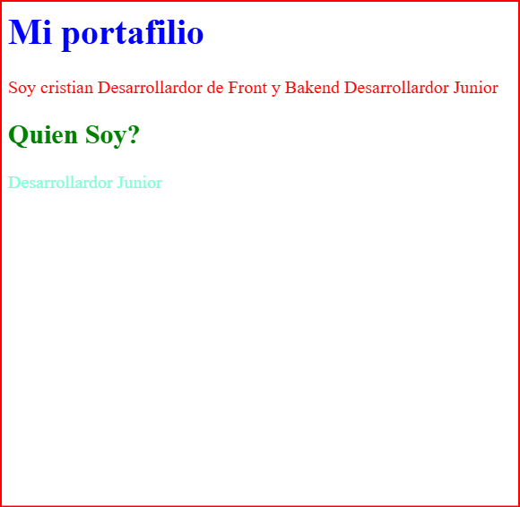

<!----Introducicion a css---->

# Curso de CSS Basico

Domina css para transformar idea en interfaces modernas, legibles, responsivas  y escalables con Flexbox y Grid. aplica tipografia, color y varibles para un Diseño visual consistente, y organiza ti codigo con buenas practicas que te preparan para construir proyectos web profesionales en la industria.

## Idea General del Curso

TEMAS PARA VER

+ Modela de caja: Entender cómo se define y controla el tamaño de los elementos.

+ Diseño Responsive

+ variables:Centralizar colores, tamaños y tipografías.
Evitar repetir estilos en múltiples archivos.
Cambiar un valor y actualizar toda la interfaz de forma consistente.

+ Herancia:La herencia permite que estilos del contenedor padre afecten a los hijos de forma controlada.
La especificidad ayuda a priorizar reglas y evitar “pisar” estilos por error.

+ Layouts:Usar layouts con Flexbox para distribuir y alinear elementos con flexibilidad.

+ Flexbox:Usar layouts con Flexbox para distribuir y alinear elementos con flexibilidad.

+ Grid:Emplear Grid para estructuras más complejas y responsivas. Diseñar proyectos 100 % responsive pensados desde mobile.

### Conoceremos 

+ sobre conocimientos de la variables y sitios responsive para la creacion de nuestro primer portaafolio importante para nuestra vida profesional contando bases solidas y herramientas modernas para resoveler proyectos reales.

>Profesor: Diego de Granda
>Proyecto: Un portafolio 100%
responsive listo para agregar proyectos.

---
## CSS: QUE ES CSS Y COMO APLICARLO EN HTML

css significa csacading Style sheets, hoaja de estilos en cascada que van de arriba hacia bajo. Quiere decir que los estilos se prierizan de los que estan abajo que los que estan arriba

Como le agragamos estilos a el elemento HTML?

<!--- TRES formas de colocar estilos en css --->

Se hace con un sistema de atributos de atributos mediante el HTML que era una formas no tan comunes de agregar estilos en css

    

      Soy cristian Desarrollardor de Front y Bakend
      Desarrollardor Junior  
    

La segunda forma de agragar un estilo en css se pueda realizar de la sigueinte forma 

    

la forma mas comun y que es la mejor practica es la tercera que se realiza con una hoja que se le da la extension .css

---

Cuando quieres agregar un estilo a todo la un atributo en css se llama al Elemento de HTML para que se se vea en todo el codigo 

---

## Selectores y especificidad

selector: Es la forma en la que se llama al HTML 

Usa el inspector del navegador: clic derecho y abrir inspector para ver HTML y estilos aplicados.
Selector de etiqueta: afecta todas las etiquetas del mismo nombre.
Selector de clase: se invoca con punto y puede repetirse en varios elementos.
Selector de ID: se invoca con numeral y solo debe existir una vez.
Evita estilos en línea como práctica habitual: tienen demasiado peso y complican el mantenimiento.

>Los elementos son los estilos perce agregar un estilo a todo la un atributo en css se llama al Elemento de HTML para que se se vea en todo el codigo 

class: la clases son genericas cualquier elemento o un solo elemento solo tiene una etiqueta de la clase para modificarlo o varios pueden tener la misma clase

    
 cualquier desarrollo c++

    .contenedor{
    border: 2px solid blue;
    }

id: El id es unico por por lo general lo utilizan mucho para darle una funcionalidad por eso es unico

    
 el id es unico c++ 

    #unico{
    background-color: yellow;
    }

A estos se les conoce como contenedores desendientes,
para hacer nuestro condigo solo modifique lo que esta dento de nuestro contenedor de div

    .contenedor p {
     color: blue;
    }

---

> hover: Es cuando el mause pasa por encima de un elemeto cambia el elemento o algo puede suceder

Priosridad de css en el estilo

Los elementos  tiene 1 puntos
La clase tienen 10 puntos
El id tiene 100 puntos 
Inline Style 1000 puntos
El !Important: Siempre gana.

Los elementos tambien tiene herencia que hereda caracteristicas a sus hijos 

    .contenedor{
     border: 2px solid blue;
     color: blue;
    }

    .contenedor p {
   
    }

Los que se herendan son los estilos de texto los demas no se heredarian ya los demas tendrias que darle su inico valor.

Los ID reescriben clases y etiquetas.
Los estilos inline y importance deben usarse con cuidado.
A mayor especificidad, más control, pero también más riesgo de conflictos.
¿Qué se hereda y qué no en CSS?
La herencia transmite estilos desde el contenedor padre a sus hijos cuando aplica a propiedades de texto.

Se heredan: color, familia tipográfica, tamaño de fuente, alineación de texto y estilos de fuente.
No se heredan: margin, padding, border, background, width, height, position.
Ejemplo de herencia.

## ¿Cómo ser más específico: selectores descendientes y contenedores?

---
