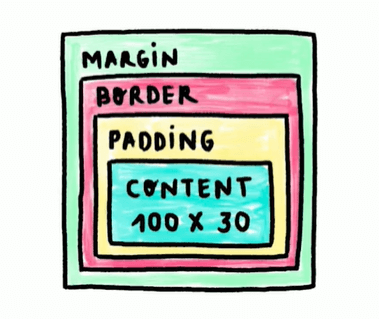
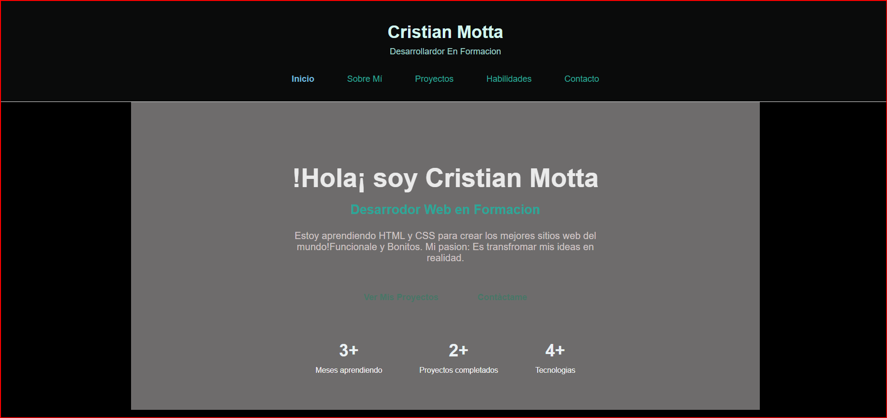

<!----Introducicion a css---->

# Curso de CSS Basico

Domina css para transformar idea en interfaces modernas, legibles, responsivas  y escalables con Flexbox y Grid. aplica tipografia, color y varibles para un Diseño visual consistente, y organiza ti codigo con buenas practicas que te preparan para construir proyectos web profesionales en la industria.

## Idea General del Curso

TEMAS PARA VER

+ Modela de caja: Entender cómo se define y controla el tamaño de los elementos.

+ Diseño Responsive

+ variables:Centralizar colores, tamaños y tipografías.
Evitar repetir estilos en múltiples archivos.
Cambiar un valor y actualizar toda la interfaz de forma consistente.

+ Herancia:La herencia permite que estilos del contenedor padre afecten a los hijos de forma controlada.
La especificidad ayuda a priorizar reglas y evitar “pisar” estilos por error.

+ Layouts:Usar layouts con Flexbox para distribuir y alinear elementos con flexibilidad.

+ Flexbox:Usar layouts con Flexbox para distribuir y alinear elementos con flexibilidad.

+ Grid:Emplear Grid para estructuras más complejas y responsivas. Diseñar proyectos 100 % responsive pensados desde mobile.

### Conoceremos 

+ sobre conocimientos de la variables y sitios responsive para la creacion de nuestro primer portaafolio importante para nuestra vida profesional contando bases solidas y herramientas modernas para resoveler proyectos reales.

>Profesor: Diego de Granda
>Proyecto: Un portafolio 100%
responsive listo para agregar proyectos.

---
## CSS: QUE ES CSS Y COMO APLICARLO EN HTML

css significa csacading Style sheets, hoaja de estilos en cascada que van de arriba hacia bajo. Quiere decir que los estilos se prierizan de los que estan abajo que los que estan arriba
<!--- TRES formas de colocar estilos en css --->

---

### Tres formas de css

Como le agragamos estilos a el elemento HTML?

Se hace con un sistema de atributos de atributos mediante el HTML que era una formas no tan comunes de agregar estilos en css

    

      Soy cristian Desarrollardor de Front y Bakend
      Desarrollardor Junior  
    

La segunda forma de agragar un estilo en css se pueda realizar de la sigueinte forma 

    

la forma mas comun y que es la mejor practica es la tercera que se realiza con una hoja que se le da la extension .css

---

Cuando quieres agregar un estilo a todo la un atributo en css se llama al Elemento de HTML para que se se vea en todo el codigo 

---

## Selectores y especificidad

selector: Es la forma en la que se llama al HTML 

Usa el inspector del navegador: clic derecho y abrir inspector para ver HTML y estilos aplicados.
Selector de etiqueta: afecta todas las etiquetas del mismo nombre.
Selector de clase: se invoca con punto y puede repetirse en varios elementos.
Selector de ID: se invoca con numeral y solo debe existir una vez.
Evita estilos en línea como práctica habitual: tienen demasiado peso y complican el mantenimiento.

>Los elementos son los estilos perce agregar un estilo a todo la un atributo en css se llama al Elemento de HTML para que se se vea en todo el codigo 

class: la clases son genericas cualquier elemento o un solo elemento solo tiene una etiqueta de la clase para modificarlo o varios pueden tener la misma clase

    
 cualquier desarrollo c++

    .contenedor{
    border: 2px solid blue;
    }

id: El id es unico por por lo general lo utilizan mucho para darle una funcionalidad por eso es unico

    
 el id es unico c++ 

    #unico{
    background-color: yellow;
    }

A estos se les conoce como contenedores desendientes,
para hacer nuestro condigo solo modifique lo que esta dento de nuestro contenedor de div

    

        <h2>Desarrolle</h2>
        
 cualquier desarrollo c++

        
 el id es unico c++ 

    

    .contenedor p {
     color: blue;
    }

---
#### Hover

> hover: Es cuando el mause pasa por encima de un elemeto cambia el elemento o algo puede suceder

---
## Prioridad

Prioridad de css en el estilo que se comporta de la siguiente manera: 

*Los elementos  tiene 1 puntos
*La clase tienen 10 puntos
*El id tiene 100 puntos 
*Inline Style 1000 puntos
*El !Important: Siempre gana.

Los elementos tambien tiene herencia que hereda caracteristicas a sus hijos 

    .contenedor{
     border: 2px solid blue;
     color: blue;
    }

    .contenedor p {
   
    }

Los que se herendan son los estilos de texto los demas no se heredarian ya los demas tendrias que darle su inico valor.

# ¿Cómo ser más específico: selectores descendientes y contenedores?

Los ID reescriben clases y etiquetas.
Los estilos inline y importance deben usarse con cuidado.
A mayor especificidad, más control, pero también más riesgo de conflictos.
¿Qué se hereda y qué no en CSS?
La herencia transmite estilos desde el contenedor padre a sus hijos cuando aplica a propiedades de texto.

Se heredan: color, familia tipográfica, tamaño de fuente, alineación de texto y estilos de fuente.
No se heredan: margin, padding, border, background, width, height, position.
Ejemplo de herencia.

---

# Pseudo-clases y Elementos

* Pseudo-clases: Las pseudoclases permiten apuntar a estados específicos del DOM. Un caso típico es el estado :focus en un input: cuando recibe clic o foco del teclado, puedes cambiar su estilo sin crear clases adicionales.

    input:focus{  /*Pseudo clase */}

* ¿Qué hace :focus y cómo aplicarlo? :focus estiliza el elemento enfocado.
Útil para alinear el diseño con la guía visual del producto.
Combina outline y background-color para dar feedback inmediato.

    <input type="text" placeholder="input">
    input:focus{  /*Pseudo clase */
    outline: 2px solid #3498db;
    background-color: #e8f4f8;
    }

Se aplica a todos los input cuando están en focus.
outline no altera el layout y destaca el elemento activo.

¿Cómo seleccionar elementos específicos en listas y tablas?

Cuando necesitas estilos solo en el primer o último elemento de una lista, o alternar filas en una tabla, las pseudoclases evitan crear clases manuales. Esto hace los selectores más específicos y mantenibles.

    <ul>
        <li>Primer item</li>
        <li>segundo item</li>
        <li>tercer item</li>
        <li>cuarto item</li>
    </ul>
    
    <table>
        <tr>
            <td>File 1</td>
        </tr>
        <tr>
            <td>File 2</td>
        </tr>
        <tr>
            <td>File 3</td>
        </tr>
        <tr>
            <td>Fila 4</td>
        </tr>
    </table>

    li:first-child{
    color: green;
    font-weight: bold;
    }

    li:last-child{
    color: red;
    font-weight: bold;
    }

    tr:nth-child(even) {
    background-color: gray;
    }

* Peudo-Elementos: Los pseudoelementos generan contenido que no existe en el HTML. Con ::before y ::after puedes añadir comillas u otros detalles visuales directamente desde CSS usando la propiedad content.

¿Cómo usar ::before y ::after con content?
::before y ::after se escriben con doble dos puntos.
content inserta el texto (por ejemplo, comillas) al inicio o al final.
El estilo del contenido se controla como cualquier nodo: color, tamaño, etc.

    
Texto con comillas

    .quote::after{  
    content: '"';
    color: blue;
    font-size: 24px;
    }

    .quote::before{
    content: '"';
    color: blue;
    font-size: 24px;
    }

Lectura: https://webdesign.tutsplus.com the-30-css-selectors-you-must-memorize--net-16048t

## Box Model

Es el modelo de caja como funciona css donde toma todos los elemenetos, que es la base fundamental de como funciona css y los estilos en css

El modelo Box se utiliza para manipular los estilos existentes en los cuales utilizamos:

>Margin: es el espacio hacia fuera del contenedor

>borde: visual de donde se encuentra el contenedor.

>padding: es el espacio interno del contenedor

Box sazing: el box sazing viene por defecto del navegador 

Border Box: La buena práctica recomendada: resetear a box-sizing: border-box desde el inicio del proyecto.
Beneficio clave: control total del tamaño sin cálculos adicionales ni desbordes inesperados.

y por lo general siempre es una buena paractica resetear estos estilos para realizar un estilo mas viable para nuestra pagina.

¿Por qué hacer un reset de estilos del navegador?
Los navegadores aplican estilos por defecto que pueden alterar tu diseño. Al quitar un reset, se notan saltos porque algunos elementos traen margin y padding predefinidos por el agente del navegador.

¿Cómo afectan padding, borde y margin el tamaño?
Cuando defines un width, el cálculo del ancho total cambia según box-sizing. Con content-box, el width aplica solo al contenido y se suman padding y borde laterales al total. Con border-box, el width incluye padding y borde, así que el elemento respeta la medida establecida.

Todo esto es para evitar sorpresas en el layout

## Position CSS

¿Qué es position en CSS y cómo se aplica?
La propiedad position define cómo un elemento se sitúa en la página y cómo responde a top, right, bottom y left. Además, z-index controla qué elemento queda por encima cuando se superponen.

Para facilitar el ejercicio, se configuraron estilos base y selección múltiple con comas para reutilizar reglas en varios contenedores

    .contenedor,
    .contenedor-padre,
    .contenedor-scroll,
    .contenedor-zindex{
        border: 2px solid black;
        margin: 20px 0;
        padding: 10px;
    }

    .caja,
    .hijo-absolute,
    .boton-fixed,
    .elemento-sticky,
    .capa{
        border: 1px solid red;
        padding: 10px;
    }

¿Cómo funcionan relative, absolute y fixed en CSS?
Estos tres modos cambian el flujo del documento y la interacción con sus hermanos y su contenedor. Entender sus diferencias evita saltos inesperados de diseño.

¿Cuándo usar position relative con top, right, bottom, left?
Con relative, mueves el elemento desde su lugar original sin afectar el espacio que ocupaba: sus hermanos lo siguen “respetando”.
    
    .caja-relative{
        position: relative;
        top: 20px;
        left: 30px;
    }

¿Qué hace position absolute dentro de un contenedor padre?
Con absolute, el elemento sale del flujo y no reserva espacio. Se posiciona respecto al primer ancestro con position configurado (comúnmente relative en el padre).

    .contenedor-padre{
    position: relative;
    height: 100px;  
    }

    .hijo-absolute {
     position: absolute;
     top: 10px;
     right: 10px;
    }

Requiere que el padre tenga position (relative, fixed o sticky). Sus hermanos no “guardan” su espacio. Se mueve libremente dentro del padre posicionado.

¿Cómo fijar un elemento con position fixed en la pantalla?
Fixed ignora el contenedor y se ancla a la pantalla. Permite botones persistentes durante el scroll.

    .boton-fixed{
    position: fixed;
    bottom: 30px;
    right: 30px;
    }

¿Cómo se comporta sticky y cómo ordenar con z-index?
Sticky combina lo mejor de relative y fixed según el scroll. Por su parte, z-index resuelve qué capa se ve al frente cuando varias se superponen.

¿Cómo lograr un encabezado con position sticky y overflow?
Primero, crea un contenedor con scroll propio y luego fija el elemento cuando toque el borde indicado.

    .contenedor-scroll{
    height: 150px;
    overflow-y: auto;
    }

    .elemento-sticky{
    position: sticky;
    top: 0px;
    }

¿Cómo controlar el orden visual con z-index y capas?
Define un contexto posicionado en el contenedor y usa z-index en elementos absolute para controlar qué queda delante.

    .contenedor-zindex{
        position: relative;
        height: 150px;
    }

    .capa {
        position: absolute;
        width: 80px;
        height: 80px;
    }

    .capa-1{
        top: 20px;
        left: 20px;
        background-color: blue;
        z-index: 1;
    }

    .capa-2{
        top: 40px;
        left: 40px;
        background-color: red;
        z-index: 2;
    }

    .capa-3{
        top: 60px;
        left: 60px;
        background-color: green;
        z-index: 3;
    }

# Organizacion Bem

La organizacion ben evita que nuestro codigo de css se ponga encima de otro cuando el codigo es mucho mas extenso

BEM significa block, element y modifier. La idea central: cada clase indica su rol y alcance. Un bloque agrupa una pieza independiente de interfaz; un elemento es una parte del bloque; un modificador expresa un estado o variante.

    

        #Elemntos
        <h2 class="card__title">Laptop Pro</h2>
        
$999

        <button class="card__button">Comprar</button>
         
        <button class="card__button card__button--disabled">Sin Stock</button>
        #Modificardor 
    

Bloque: representa un componente como una tarjeta, por ejemplo, card.
Elemento: se nombra con doble guion bajo: card__title, card__price, card__button, card__badge.
Modificador: se nombra con doble guion: card--feature, card__button--disable.
Así se evita que estilos globales se mezclen: cada selector apunta a un contexto específico.

¿Cómo se estructura un bloque, elemento y modificador?
Bloque independiente: card agrupa borde, padding y tamaño máximo.
Elementos internos: card__title, card__price, card__button y card__badge heredan el contexto de card.
Modificadores: --feature para destacar la tarjeta y --disable para estados del botón.
¿Cómo nombrar clases con BEM en una tarjeta card?
La tarjeta funciona como bloque principal. Dentro, se definen elementos para el título, el precio, los botones y un badge. Luego se aplican modificadores para estados específicos.

Borde visible para distinguir componentes.
Padding interno uniforme.
Margin-bottom para separar tarjetas.
Max-width para controlar el crecimiento.
¿Cómo estilizar los elementos title, price y button?
Se aplican estilos puntuales a cada elemento, sin afectar otros bloques.

    .card__title {
     color: #333;
     margin-bottom: 50px;
    }

    .card__price {
    font-size: 24px;
    font-weight: bold;
    margin-bottom: 25px;
    }

    .card__button {
    padding: 10px 20px;
    background-color: #333;
    color: white;
    border: none;
    cursor: pointer;
    margin-right: 5px;
    }

Señal visual clara con contraste.
Tamaño compacto y legible.
¿Cómo usar modificadores para estados como feature y disable?
Los modificadores expresan variaciones: uno para el bloque completo (feature) y otro para el botón deshabilitado (disable). Separar estado de estructura mantiene el CSS limpio y predecible.

.card--feature {
  border-color: gold;
  border-width: 3px;
}
Visual más prominente sin romper la consistencia.
Reutilización del bloque con mínimos cambios.
¿Cómo comunicar un botón deshabilitado con card__button--disable?
El estado de “no permitido” se refleja en color y cursor.

.card__button--disable {
  background: grey;
  cursor: not-allowed;
}

## Unidades de medida

Elegir la unidad correcta en CSS es clave para lograr un diseño responsive, accesible y controlado. Aquí se explica, con ejemplos claros, cuándo usar px, %, rem, em, vw y vh, sus ventajas y sus límites en contenedores y texto. Además, verás por qué rem mejora la accesibilidad y cómo vw/vh simplifican ocupar toda la pantalla.

¿Cómo usar porcentajes para contenedores flexibles?
El porcentaje se calcula con base en el contenedor padre. Si ese padre tiene dimensiones, tu caja puede adaptarse. Por ejemplo, 50% tomará la mitad del ancho disponible del padre, y se mantendrá proporcional al redimensionar la ventana.

tipos de unidades de medida en css 

El pixel es la unidad de medida fija cuando le das un tamaño a un contenedor solo le das una unidad de medida fija.

    .box-pixel {
        border: 1px solid red;
        padding: 16px;
        width: 200px;
    }

Depende del tamaño del contenedor padre.
Permite contenedores flexibles y relativos.
Requiere que el padre tenga dimensiones definidas.
Ejemplo:

    .box-percent {
        border: 1px solid red;
        padding: 16px;
        width: 50%;
    }

cuando quieres pasar a tablet o movil los pixeles te pueden jugar una mala pasada el porcentaje es la opcion mas vieble para ese tipo de tamaños 

Rem es bueno para utilizarlos en las funtes pero para las mediadas no es tan bueno: 1 rem es igual a 16px

1 em es igual 16px la diferencia de rem si le agrgamos on font-zice crece el font-zice y crece el contenedor por eso es mejor utilizar el rem por uqe cambia el tamñano de la fuente 

VW sera el procentaje de pantalla que sera 30% del ancho de la pantalla

    .box-vw {
        border: 1px solid red;
        padding: 16px;
        width: 30vw;
    }

vh sera el alto de la pantalla que 30% del alto de la pantalla 
    .box-vh {
        border: 1px solid red;
        padding: 16px;
        height: 20vh;
    }

¿Qué diferencias hay entre rem, em, vw y vh?
Estas unidades relativas resuelven necesidades distintas. rem y em se basan en el font-size; vw y vh usan el tamaño del viewport. Elegir bien evita comportamientos inesperados y mejora la accesibilidad.

Habilidades que practicas aquí: - Definir dimensiones con px, %, rem, em, vw y vh según el objetivo. - Usar el inspector para verificar comportamientos en diferentes tamaños de pantalla. - Priorizar rem para tipografías y medidas previsibles; evitar acumulación indeseada de em. - Aplicar vw/vh para bloques adaptados al viewport, como un hero a pantalla completa.

## Proyecto final

segun lo realizado en la clase de fundamentos de css realizamos un pequeño portafolio donde se muestra todo lo aprendido por el momento

## Fuentes Web

Elegir y configurar fuentes web en CSS define la legibilidad y el estilo de una interfaz. Aquí aprenderás a usar familias tipográficas del navegador, crear un font stack con fallback confiable y cargar tipografías de Google Fonts como Poppins e Inter, con pesos y variaciones bien seleccionados para títulos y textos.

 Fuentes y la legibilidad 
---

Funtes especificas y como modificarlas de diferentes maneras 

Existen 5 familias especificas de Fuentes

Serif: con “decoraciones” al final de los trazos. Ejemplo típico: Times New Roman. Da un aire clásico y editorial.
Sans-serif: sin decoraciones. Ejemplos comunes: Arial, Helvetica. Se percibe más limpia y moderna.
Monospace: ancho fijo en cada carácter. Ideal para mostrar código.
Cursive: simula escritura a mano.
Fantasy: más decorativa y expresiva.

Como utilizar las fuentes en css:

    .serif{
        font-family: serif;
        font-size: 20px;
    }

    .sans-serif{
        font-family: sans-serif;
        font-size: 20px;
    }

    .monoespace{
        font-family: monospace;
        font-size: 20px;
        background: #f0f0f0;
        padding: 5px;
    }   

    .google-title{
        font-family: "Popins", sans-serif;
    }

    .google-text{
        font-family: "Itern", sans-serif;
    }

## Fall back

las fuentes en los navegadores pueden ser modificadas o verificar que tipo de funtes que tiene en existencia el navegador y si es un nuestra el navegador la interpreta y la guarda 

Si quieres utilizar otro y tipo de fuentes 
podemos utilizar:

* FONTS-GOOGLE.COM

Recomendacion utiliza siempre dos tipos de fuentes diferentes.

Importate!
---

> Buena práctica: termina el stack con una familia genérica. Garantiza renderizado consistente si falla la fuente primaria.

> Compatibilidad: algunas fuentes existen solo en ciertos sistemas (Mac OS o iOS) y no en Windows. El fallback evita inconsistencias.

> Confiabilidad: si se cae el servicio de fuentes, el fallback entra sin romper el diseño.

## Propiedades Tipográficas

Mejora la legibilidad y accesibilidad dominando las propiedades tipográficas de CSS: font-size con rem, font-weight, line-height y font-style. Con pequeños ajustes, el texto se vuelve más claro, cómodo y consistente en distintos dispositivos. Aquí verás cómo aplicar estos cambios con clases simples como normal, light, bold, compact, space e italic.

las propiedades son las que ayudan a modificar las funtes.

Font-size: Tamaño de letra el 1rem se adapta al tamaño de las pantallas

font weight: Grosor de 100 a 400 no se nota ningun cambio de 500 a 900 es como tener un bold

    .light {
        font-weight: 300;
    }

    .bold {
        font-weight: 900;
    }

line-height: Altura de interlinea puedes darle un 'aire' al espacio de los parrafos
o lineas que hay entre parrafos

    .compact {
        line-height: 1;
    }

    .space {
        line-height: 2;
    }

font-style: darle un estilo unico a nuestra fuente 

.italic {
  font-style: italic;
}

.oblique {
  font-style: oblique;
}

.normal {
  font-style: normal; /* valor por defecto */
}

## Control de Texto

¿como controlo mi texto en HTML?
Cuando queremos hacer un desarrollo web queremos realizar un desarrollo, necesitamos colocar nuestro texto de forma adecuada para esto funciona.

Controla tu tipografía con precisión usando propiedades clave de CSS para alinear, transformar, decorar e indentar texto. Aquí verás cómo aplicar text-align, text-transform, text-decoration y text-indent de forma clara, con ejemplos prácticos y consideraciones de maquetación.

¿Cómo alinear texto con CSS sin complicaciones?
La alineación define la posición del contenido dentro de su contenedor. Por defecto, los párrafos se alinean a la izquierda y ocupan el 100 % del width disponible. Con la propiedad text-align puedes usar valores como left, center, right y justify para lograr el resultado deseado. El centrado funciona mientras el contenedor tenga espacio; si no, necesitarás otras técnicas de maquetación.

> Left: alineación por defecto a la izquierda.
> Center: centra el texto dentro del ancho disponible.
> Right: empuja el texto hacia la derecha.
> Justify: distribuye espacios para ocupar el ancho completo en cada línea.
Nota: justify ajusta los espacios entre palabras en líneas con suficiente contenido. Si una línea tiene pocas palabras, no forzará espacios excesivos.

* .uppercase { text-transform: uppercase; }
* .lowercase { text-transform: lowercase; }
* .capitalize { text-transform:   capitalize; }
* Uppercase: convierte todo a mayúsculas.
* Lowercase: transforma a minúsculas.
* Capitalize: pone en mayúscula la letra 
inicial de cada palabra.

Estas opciones ayudan a mantener consistencia tipográfica según el tono o la formalidad del contenido.

## Aplicacion de fuentes de Google y estilos Css al protafolio

a

---

## sistemas de color

Domina cómo aplicar color en CSS con hexadecimal, RGB, HSL, alfa (RGBA) y nombres de color. Verás cómo estos sistemas controlan el background-color, el texto y los bordes, con ejemplos claros para evitar dudas comunes y lograr tonos exactos

Formatos de colores en css

* Hexadecimal (#RRGGBB): valores 0–9 y A–F. Dos dígitos por canal. Empieza con numeral. 000000 es negro. FFFFFF es blanco.  

* RGB (rgb(r, g, b)): tres valores del 0 al 255 por canal. 0 apaga el canal, 255 lo lleva al máximo.

* HSL (hsl(h, s%, l%)): tono en grados 0–360, saturación 0–100 %, luminosidad 0–100 %.

* Alfa (rgba): cuarto valor 0–1 para transparencia. 1 es sólido; 0, totalmente transparente.

/* Blanco y negro. */
.box-blanco { background-color: #FFFFFF; }
.box-negro  { background-color: #000000; }

/* Rojo con combinación alta en R y valores menores en G y B. */
.box-rojo   { background-color: #FF5733; }
Claves prácticas: - Empieza con #. Siempre seis dígitos. - FF es el máximo del canal. 00 es el mínimo.

¿Qué hacen rgb y rgba con el color y la transparencia?
En rgb(r, g, b) cada canal va de 0 a 255. Es muy directo para ajustar intensidad por canal y es como se renderizan las imágenes en el navegador: píxel a píxel combinando RGB.

/* Primarios. */
.box-negro  { background-color: rgb(0, 0, 0); }
.box-rojo   { background-color: rgb(255, 0, 0); }
.box-verde  { background-color: rgb(0, 255, 0); }
.box-azul   { background-color: rgb(0, 0, 255); }

/* Azul verdoso medio tenue. */
.box-azul-tenue { background-color: rgb(52, 152, 219); }
Con rgba(r, g, b, a) agregas el alfa para transparencia del 0 al 1.

/* Sólido. */
.box-solida { background-color: rgba(231, 76, 60, 1); }
/* Media transparencia. */
.box-media  { background-color: rgba(231, 76, 60, 0.5); }
/* Más tenue. */
.box-tenue  { background-color: rgba(231, 76, 60, 0.25); }
Pautas rápidas: - Alfa en 1: color 100 % sólido. - Alfa en 0.5: semítransparente. - Alfa en 0.25: muy tenue.

¿Cómo leer y ajustar hsl con tono, saturación y luminosidad?
En hsl(h, s%, l%): - h es el tono en grados 0–360. Se recorre por los principales: del 0 hacia rangos cercanos se perciben rojos; más adelante verdes; después azules. - s es saturación en %: 0 % da grises, 100 % da color puro. - l es luminosidad en %: 0 % es negro, 50 % color “normal”, 100 % blanco.

/* Rojo con saturación media y luminosidad media. */
.box-hsl { background-color: hsl(0, 50%, 50%); }
Nota sobre nombres de color: también puedes declarar colores por nombre cuando necesitas rapidez en background-color o color de texto.

.titulo { color: green; }
.destacado { background-color: gold; }
¿Qué habilidades y conceptos clave practicar?
Potencia tu dominio con estas prácticas. Te darán control fino del color según el contexto de diseño y accesibilidad.

##