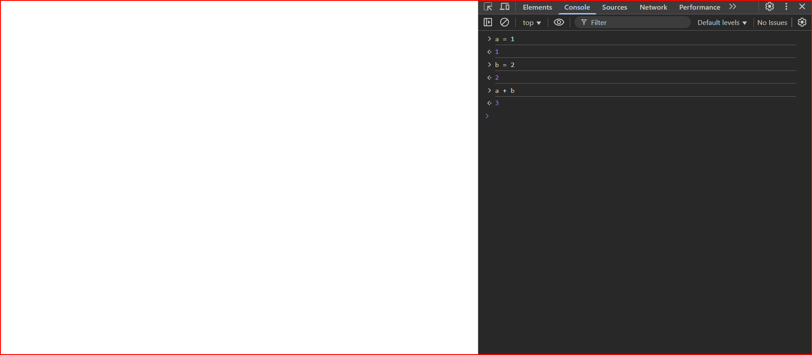
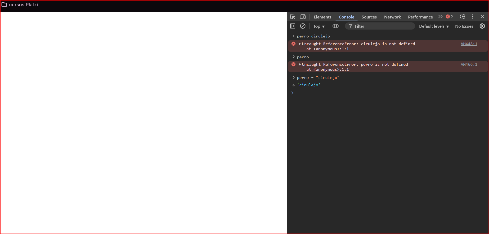

# Fundamentos de programacion basica

En este curso de fundamentos de programcion de platzi 
tendremos la oportunidad de verificar como se hace posible la creacion de codigo como aprender a hacerlo de manera correcto y creativa por ende miraremos como se crea un video juego en linea que nos enseñara a consturir este proyecto en 6 modulos que se dividen en 

* Fundamentos de programción 
* Desarrollo de juego con HTML Y JavaScript
* Estilos con css
* Optimizacion de codigo
* Mapa de Canvas
* Backend: videojuego multijugador 

> NOTA: Es importante Escribir el codigo y entenderlo para asi aprender de una forma mas practica 

## Programacion Basica en Google Chrome Variables y Funciones 

Una Forma para empezar a programar no es necesario que empieze con programas complejos solo abriendo google en la barra de busqueda podemos colocar about:blank y dandole click derecho en inspeccionar nos aparecera el contenenido para programar en console que este seria el ambiente de programación basico donde podremos colocar variables y funciones que son:

> Variables: Una variable en programación es una forma de almacenar un dato específico.
Por ejemplo, si a = 1 y b = 2, la computadora entiende que estas son dos variables que contienen valores numéricos.
Al realizar una operación como a + b, el sistema suma los valores almacenados en las variables y produce un resultado, que en este caso es 3.
Las variables permiten guardar, reutilizar y manipular datos dentro de un programa.

La informacion de una varible por lo general se guarda en la memoria de corto alcance que es bien conocida como ram y esta informacion se almacena durante el tiempo que nosostros trabajemos con nuestro computador 

---

> Funciones: Las funciones en programación son bloques de código que realizan una tarea específica.
Pueden recibir variables como entrada, procesarlas y devolver un resultado o mostrar un mensaje.
A diferencia de las variables, las funciones no almacenan datos, sino que ejecutan acciones.
Una función se puede crear una sola vez y llamarla cada vez que sea necesaria dentro del programa.

Las funciones tambien son similares a las variables pero aca en vez de utilizar un numerico podemos guardar todo tipo de parametro en este caso podemos en una guardar perro="cirulejo" y nos mostrara el que perro es igual a cirulejo pero si perro no tiene comillas no lo detectara como una cadena de texto y no podra mostra el mensaje nos mostrara un error 

